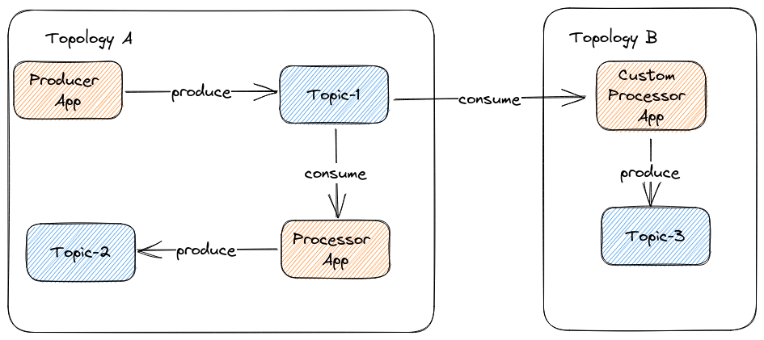

# kafkakewl

kafkakewl helps with managing kafka topics and ACLs in a declarative way. Users define their kafka topics and consuming / producing applications in topology files that kafkakewl can deploy to a kafka cluster.

These topologies form a graph of topics and applications which the web UI visualizes and allows user to traverse.

kafkakewl also exposes metrics about these topics and applications like lag, consumer status, topics' incoming message rate.

## History

There is already a working version which we'd like to redesign and rewrite to work better in a number of use-cases, e.g. integrating with gitops workflows, deploying different topologies in different kafka-clusters.

This existing version is in maintenance mode, not actively worked on. Feel free to check it out here, but we won't support it in the future.

We plan to simplify the new version and abandon the 2 step deployment model (submit the topology file, then deploy it to various kafka-clusters). Instead, each kafka-cluster is managed by a separate instance of kafkakewl and topologies are just deployed with these, completely independently to each kafka cluster.

## Overview

kafkakewl can deploy multiple topologes describing topics and consuming/producing applications as yaml/json. These topologies can reference topics/applications in one another (if it's enabled) similarly to programming languages' packages/classes/visibility rules:

kafkakewl takes these high-level descriptions of topics and applications and generates actual kafka topics and ACLs. Then it checks what's already in the kafka-cluster, and deploys what's missing or changes what's different.

## Current status

The planning and development of the new version of kafkakewl has been started, watch this repo for updates!

## License

It's licensed under [Apache-2.0](https://spdx.org/licenses/Apache-2.0.html#licenseText).
